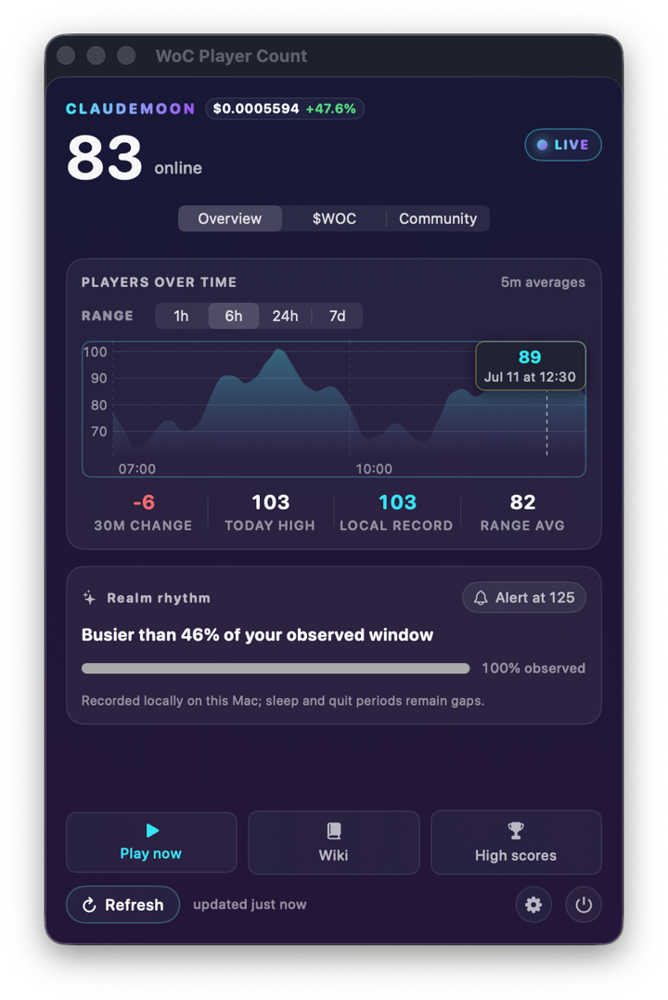

# WoC Player Count

[](https://github.com/FernandoX7/woc-widget/actions/workflows/ci.yml)
[](https://github.com/FernandoX7/woc-widget/actions/workflows/live-api-contracts.yml)
[](LICENSE)
[](https://www.apple.com/macos/)

<p align="center">
  
</p>

A beautiful native macOS menu-bar companion for
[World of ClaudeCraft](https://worldofclaudecraft.com). It keeps live realm population and the
`$WOC` market visible at a glance, then opens into a focused dashboard for local history, community
activity, and configurable alerts.

> **Independent community project.** WoC Player Count is not affiliated with or endorsed by World
> of ClaudeCraft, Dream Home AI Limited, or Levy Street. It never asks for game credentials or a
> wallet connection.

> **Source-only distribution.** This repository does not currently publish a prebuilt app, ZIP, or
> DMG. Building and installing it yourself requires full Xcode, but it does **not** require a paid
> Apple Developer Program membership. Versioned GitHub releases are source snapshots and release
> notes, not downloadable macOS applications.

This is a menu-bar app, not a WidgetKit extension: it has no Dock icon, desktop widget, or separate
settings window.



## Highlights

- **One calm menu-bar signal** — show Players + `$WOC`, Full, Players, or Token. Stale values are
  visibly distinguished and unavailable prices are never presented as live.
- **Realm overview** — live status, 1h / 6h / 24h / 7d population history, 30-minute change, today's
  high, local record, range average, and local Realm Rhythm context.
- **Honest history** — legible automatic resolution, a bounded point count, and real gaps when the
  Mac was asleep or the app was not running. Hover or use arrow keys to inspect observations.
- **Integrated `$WOC` market** — validated DEX Screener spot/rolling metrics and real GeckoTerminal
  OHLCV candles, with independent live, cached, loading, and unavailable states.
- **On-demand community view** — project totals, latest release, lifetime-XP leaders, realm details,
  and useful game links. One failed feed does not blank the others.
- **Smart alerts** — realm down/recovered, records, busy-realm thresholds, rolling gains/losses,
  price targets, and releases, with cooldowns, quiet hours, hysteresis, mute, and disable actions.
- **Private by design** — no companion account, telemetry, advertising, analytics, password, or
  wallet access. History and preferences stay on the Mac.
- **Mac-native accessibility** — semantic VoiceOver output, Audio Graph descriptors, keyboard chart
  inspection, Dynamic Type, non-color candle encoding, and system accessibility accommodations.

## Install from source

You need macOS 14 or newer and a full Xcode 16+ installation—not only the standalone Command Line
Tools. Install Xcode, open it once to finish setup, and then run:

```bash
git clone https://github.com/FernandoX7/woc-widget.git
cd woc-widget
./install.sh
```

`install.sh` checks the local toolchain, compiles the app for the Mac it is running on, ad-hoc signs
the bundle locally, installs it, and launches it. It never reads an Apple account, distribution
certificate, or notarization credential. Do not run the installer with `sudo`. If full Xcode is not
selected, the preflight prints the exact `xcode-select` command to run before trying again.

On a first install, the installer prefers `/Applications/WoC Player Count.app`. If that directory
is not writable and no system-wide copy exists, it safely falls back to
`~/Applications/WoC Player Count.app`. Later installs update whichever standard location already
contains the app. It replaces only an app with the same bundle identity and rolls back if activation
or signature verification fails. If it finds two copies or cannot choose a safe destination, it
stops with an explanation rather than creating another copy or launching an ambiguous build. The
terminal prints the exact installed path. Settings and player history are not removed.

The world-and-signal icon appears in the menu bar after launch. The app is an `LSUIElement`, so it
does not appear in the Dock. Use the power button in the popover footer to quit.

Read the [local installation guide](docs/LOCAL_INSTALL.md) for updating, uninstalling, alternate
install locations, and safe first-launch troubleshooting.

## Dashboard

The popover keeps one stable 440×660 frame across its four destinations:

| Destination | What it shows |
| --- | --- |
| Overview | Realm health, player history, local records, and Realm Rhythm |
| `$WOC` | Quote, rolling activity, liquidity, volume, transactions, candles, and market alerts |
| Community | Project statistics, releases, lifetime-XP leaders, realms, and game links |
| Settings | Alerts, refresh intervals, menu label, launch at login, local data, and About links |

The footer stays pinned, every page owns its scrolling, and refresh always acts on the current
context.

## Privacy

WoC Player Count makes direct HTTPS requests to World of ClaudeCraft, DEX Screener, and
GeckoTerminal. Those services receive ordinary connection metadata such as an IP address. The app
itself has no analytics or backend.

Observed player history is retained locally for seven days. Settings can export it or permanently
remove both the primary and recovery snapshots. Read [PRIVACY.md](PRIVACY.md) for the complete data
flow, storage locations, defaults domain, and removal instructions.

## Data sources and disclaimer

- World of ClaudeCraft public APIs provide realm and community data.
- [DEX Screener](https://dexscreener.com) provides spot and rolling market metrics.
- [GeckoTerminal](https://www.geckoterminal.com) provides OHLCV candles.

Providers and artwork are documented in [CREDITS.md](CREDITS.md). `$WOC` data is informational and
may be delayed, incomplete, or wrong. This app does not issue or control the token, and nothing in
the app or repository is financial advice or a recommendation to trade.

## Update or develop

There is no automatic updater. Update a source installation from its repository checkout:

```bash
cd woc-widget
git pull --ff-only
./install.sh
```

This replaces the installed app while preserving its local settings and history. If `git pull`
reports local changes, preserve or commit them before updating rather than discarding them.

The repository intentionally has no Xcode project. `build.sh` compiles the complete `Sources/` tree
with `swiftc`, assembles the bundle, compiles the String Catalog with `xcstringstool`, and ad-hoc
signs local bundles.

Other useful commands:

```bash
./build.sh           # build + install, without relaunching
./build.sh bundle    # production bundle under build/; no install or launch
./build.sh check     # type-check every app and view source
./build.sh preview   # windowed, synthetic-data preview; never installed
./install.sh --check # verify local installation prerequisites without building
swift test           # deterministic WoCKit tests
./scripts/verify.sh  # complete production verification, including idle-resource checks
```

Local builds are intended only for the person who built them. Do not redistribute an ad-hoc-signed
`.app` as an official download, and never disable Gatekeeper to open one. The optional future
Developer ID and notarization process is documented separately in
[docs/RELEASE.md](docs/RELEASE.md).

## Architecture and visual QA

The app keeps SwiftUI presentation separate from a SwiftUI-free WoCKit domain layer. Feed states,
history repair, alert policies, and preview fixtures are deterministic and independently testable.

See [docs/ARCHITECTURE.md](docs/ARCHITECTURE.md) for data flow, persistence and alert invariants,
popover constraints, accessibility contracts, and the composable preview matrix. See
[docs/VERIFICATION.md](docs/VERIFICATION.md) for the verification gate.

## Known boundaries

- Population history is observed locally while the app runs; it cannot backfill sleep or quit time.
- The companion intentionally presents aggregate population rather than a separate online-player
  roster.
- Community and market services are best-effort and have no uptime guarantee. Cached values remain
  visible with honest provenance when possible.
- Account-linked character data is out of scope until an appropriate public OAuth/API contract
  exists. The app never scrapes a browser session or requests a game password.
- There is no binary or automatic update feed; source installations update with `git pull` followed
  by `./install.sh`.

## Uninstall

1. Quit WoC Player Count and remove it from `/Applications` or `~/Applications`, depending on the
   location printed by the installer.
2. Disable its login item in **System Settings → General → Login Items** if present.
3. Optionally remove all companion-owned data:

   ```bash
   rm -rf "$HOME/Library/Application Support/WoCWidget"
   defaults delete io.github.fernandox7.wocplayercount 2>/dev/null || true
   ```

## Contributing and security

Contributions are welcome. Start with [CONTRIBUTING.md](CONTRIBUTING.md), keep fixtures synthetic,
and run the verification gate before opening a pull request. Use the private process in
[SECURITY.md](SECURITY.md) for vulnerabilities rather than a public issue.

Notable public changes are recorded in [CHANGELOG.md](CHANGELOG.md).

## License

WoC Player Count source and original companion artwork are available under the
[MIT License](LICENSE). Third-party names and data remain subject to their owners' terms; see
[CREDITS.md](CREDITS.md).
